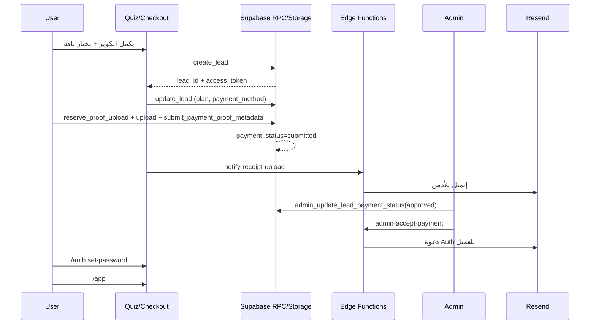

# Hakim Coaching — Master Project Documentation

**الإصدار:** 1.0  
**التاريخ:** 2026-07-07  
**النطاق:** وثيقة هندسية رسمية للمشروع بالكامل  
**المستودع:** `hakimlemagicien`  
**النطاق الإنتاجي:** `https://hakimlemagicien.com`  
**مشروع Supabase:** `ufgrbpakuemamggwypdh`

---

> **تعليمات القراءة:**  
> - **موظف جديد؟** اقرأ أولاً [`PROJECT_HANDBOOK.md`](./PROJECT_HANDBOOK.md) — دستور الشركة الرسمي.  
> - **تفاصيل تقنية؟** هذه الوثيقة (Master Documentation) هي مصدر الحقيقة التقنية.  
> - مبنية على قراءة الكود الفعلي، migrations، Edge Functions، Routes، Components، وscripts.  
> - عند غياب ميزة في الكود يُذكر صراحةً: **«غير موجود حالياً»**.  
> - يُفرَّق دائماً بين **الموجود** و**الرؤية المستقبلية**.

---

# 1. Executive Summary

## ما هو المشروع؟

**Hakim Coaching** منصة رقمية عربية (RTL) لتقديم **برامج تدريب وتغذية مخصصة** تحت إشراف الكوتش حكيم. المنتج **رقمي بالكامل** — ليس تدريباً حضورياً. يبدأ المستخدم برحلة تسويقية (Landing + Quiz تحليل شخصي)، ثم يختار باقة ويدفع عبر **تحويل بنكي يدوي**، وبعد موافقة الأدمن يحصل على حساب ويدخل **منصة الأعضاء** (`/app`).

## الهدف

تحويل الزائر إلى عميل مدفوع عبر Funnel واضح، ثم إبقاؤه داخل منصة يومية (تمرين، تغذية، تقدم، دعم) مع تمييز بين **عضو مجاني** و**عضو Premium**.

## العميل / الجمهور

- رجال ونساء عرب (الخليج، المغرب العربي، وغيرها)
- أهداف: خسارة دهون، بناء عضلات، لياقة، شد الجسم، ثقة بالنفس
- محتوى الكويز والصور مخصص للجنسين (ذكر/أنثى)

## ما الذي يقدمه المنتج حالياً؟

| الطبقة | الحالة |
|--------|--------|
| موقع تسويقي (Landing) | ✅ مكتمل |
| كويز تحليل شخصي + Checkout | ✅ مكتمل (تحويل بنكي فقط) |
| لوحة أدمن للمدفوعات | ✅ مكتمل |
| مصادقة + دعوة بالبريد (Resend) | ✅ مكتمل |
| منصة `/app` — Shell + Home | ✅ Phase 1 |
| برنامج / تغذية / تقدم حقيقي | 🚧 Placeholder |
| مكتبة تمارين داخل التطبيق | 🚧 JSON + Script خارجي فقط |
| دفع إلكتروني (بطاقة/PayPal) | 🚧 معطّل في UI |

## رؤية المشروع

منصة لياقة عربية متكاملة: تحليل شخصي → اشتراك → برنامج يومي → تغذية → تتبع → دعم كوتش — مع محتوى مجاني (Daily Feed) ومحتوى Premium مقفل، وإمكانية توسيع لاحق لمنتجات رقمية وYouTube ومدونة.

---

# 2. Current Project Status

## 2.1 ما تم إنجازه ويعمل فعلاً

### التسويق والتحويل
- **Landing Page** (`/`) — أقسام كاملة: Hero، مشاكل/حلول، نتائج 90 يوم، قصص نجاح، تسعير، FAQ، CTA
- **Quiz** (`/quiz`) — فانل متعدد الخطوات (~5800 سطر): جنس، أهداف، قياسات، تحديات، تسعير، دفع
- حفظ تقدم الكويز في `localStorage`
- إنشاء Lead عبر RPC `create_lead`
- **Checkout** — تحويل بنكي (NBD الإمارات، CIH/BMCE المغرب)، رفع إيصال، إشعار أدمن

### الدفع والأدمن
- `/admin/payments` — مراجعة إيصالات، قبول/رفض، إعادة إرسال رابط الدخول
- Edge Functions: `admin-accept-payment`, `admin-resend-access`, `notify-receipt-upload`
- إيميلات عبر **Resend** (ليس إيميل Supabase الافتراضي)

### المصادقة
- `/auth` — تسجيل دخول، تسجيل، تعيين كلمة مرور (invite/recovery)
- توجيه بعد Auth → `/app`
- `/dashboard` → redirect إلى `/app`

### المنصة (Phase 1)
- `/app` — واجهة موبايل متقدمة: ترحيب، Streak/Points (localStorage)، Daily Feed (seed)، Premium Preview، Upgrade → `/quiz`
- Coach Chat مؤقتاً: **WhatsApp** (`https://wa.me/971505129019`) للـ Premium في `/app/support`
- Gating: Free يرى قفل + Upgrade؛ Premium يفتح الروابط

### البنية التحتية
- TanStack Start + Vite + Nitro → Vercel
- Supabase: Auth, DB, Storage, Edge Functions, RLS
- CI: `.github/workflows/deploy.yml` — نشر على `main`

### مكتبة التمارين (خارج التطبيق)
- `scripts/exercise-library.json` — **320 تمرين** في 13 مجموعة
- `scripts/create-exercise-library.sh` — إنشاء هيكل مجلدات على الجهاز المحلي
- نسخة احتياطية: `scripts/backup/` بتاريخ 2026-07-06

## 2.2 Placeholder (واجهة موجودة، محتوى غير حقيقي)

| المسار | الوصف |
|--------|--------|
| `/app/discover` | «Phase 4» — مكتبة محتوى مجاني |
| `/app/program` | «Phase 2» — أيام البرنامج الكامل |
| `/app/nutrition` | «Phase 2» — خطة غذائية |
| `/app/progress` | «Phase 2» — رسوم وقياسات |
| `/app/support` | FAQ/نموذج تواصل «Phase 2» (WhatsApp فقط حقيقي للـ Premium) |
| `/app/profile` | Payment History «Phase 2» |
| Daily Feed في Home | `seed-content.ts` — نصوص ثابتة |
| Streak / Points | `localStorage` فقط — غير متزامن مع DB |
| إشعارات Home (badge 3) | UI ثابت — غير مرتبط بنظام إشعارات |

## 2.3 لم يبدأ بعد / غير موجود

- مكتبة تغذية (`nutrition-library.json` أو ما شابه) — **غير موجودة**
- ربط مكتبة التمارين (`exercise-library.json`) بالتطبيق — **غير موجود**
- In-app Coach Chat — **غير موجود**
- Paddle / Stripe في Checkout UI — **معطّل** («قريباً»)
- جداول `payments` و`quiz_answers` — موجودة في Schema **لكن التطبيق لا يستعلم عنها** حالياً
- صفحات عامة `/programs`, `/blog` — **غير موجودة**
- RPC لقراءة `leads` للمستخدم العادي — **غير موجود** (RLS يمنع SELECT المباشر)
- PWA كامل / Push notifications — Service Worker مسجّل؛ إشعارات Push **غير موجودة**
- `README.md` — **فارغ**

---

# 3. Folder Structure

```
hakimlemagicien/
├── src/
│   ├── routes/              # صفحات TanStack Router (file-based)
│   ├── components/          # UI: landing, platform, checkout, legal, motion, ui
│   ├── hooks/               # useMembership, useStreak, quiz hooks
│   ├── lib/                 # منطق الأعمال، APIs، seed، platform
│   ├── integrations/supabase/  # client, types, auth middleware
│   ├── assets/              # صور عربية (كويز، تحوّلات، أهداف)
│   ├── styles.css           # Design tokens + utilities
│   ├── router.tsx
│   ├── routeTree.gen.ts     # ⚠️ مُولَّد — لا تعدّل
│   ├── server.ts / start.ts
│   └── ...
├── supabase/
│   ├── migrations/          # SQL schema, RLS, RPCs
│   ├── functions/           # Edge Functions + _shared
│   ├── config.toml
│   └── email-templates/
├── scripts/
│   ├── exercise-library.json
│   ├── create-exercise-library.sh
│   ├── backup/
│   └── verify-vercel-build.mjs
├── docs/                    # هذه الوثيقة
├── .vercel/output/          # مخرجات البناء (Nitro)
├── vite.config.ts
├── vercel.json
├── AGENTS.md                # قواعد Lovable
└── package.json
```

## وظيفة المجلدات الرئيسية

| المجلد | الوظيفة | يتصل بـ |
|--------|---------|---------|
| `src/routes/` | تعريف المسارات والصفحات | `components/`, `lib/`, `hooks/` |
| `src/components/` | عرض UI حسب السياق | `lib/`, `assets/` |
| `src/lib/` | منطق غير مرئي: lead, payments, membership | `integrations/supabase/` |
| `src/integrations/supabase/` | عميل Supabase وأنواع DB | Supabase Cloud |
| `supabase/migrations/` | مصدر الحقيقة لـ Schema وRLS | `types.ts` (يُحدَّث يدوياً/أداة) |
| `supabase/functions/` | منطق خادم: إيميل، قبول دفع | Resend, service role |
| `scripts/` | أدوات محلية (مكتبة تمارين) | خارج التطبيق |

---

# 4. Architecture

## 4.1 نظرة عامة

```
[المتصفح]
    │
    ▼
[TanStack Start / React 19] ──► [Vite Build] ──► [Nitro preset: vercel]
    │
    ├── Client: Supabase JS (Auth, RPC, Storage)
    │
    └── Edge Functions (Deno)
            ├── admin-accept-payment
            ├── admin-resend-access
            └── notify-receipt-upload
                    │
                    ▼
            [Supabase PostgreSQL + Storage + Auth]
                    │
                    ▼
            [Resend API] ──► إيميلات العملاء والأدمن
```

## 4.2 Frontend

| التقنية | الإصدار/الاستخدام |
|---------|-------------------|
| TanStack Start | Full-stack React framework |
| TanStack Router | File-based routing |
| TanStack Query | Server state في `__root.tsx` |
| React | 19 |
| Vite | 8 |
| Tailwind CSS | v4 (`@theme inline`) |
| Framer Motion | حركات الكويز |
| Radix UI + shadcn | `src/components/ui/` (~48 مكوّن) |
| Lucide React | أيقونات |

**ملاحظة Lovable:** `vite.config.ts` يستخدم `@lovable.dev/vite-tanstack-config` — المشروع متصل بـ Lovable.dev.

## 4.3 Backend

لا يوجد خادم Node مخصص للـ API. المنطق الخادمي عبر:
1. **Supabase RPC** (SECURITY DEFINER)
2. **Supabase Edge Functions**
3. **Supabase Auth** (جلسات JWT)

## 4.4 Supabase

- **Project ID:** `ufgrbpakuemamggwypdh` (`supabase/config.toml`)
- **Auth:** Email/password؛ روابط invite/recovery → `/auth`
- **Storage:** bucket `payment-proofs`
- **RLS:** مفعّل على كل الجداول؛ `leads` بدون SELECT مباشر للمستخدمين

## 4.5 Deployment

- **المنصة:** Vercel
- **البناء:** `npm run build` → `.vercel/output/`
- **التحقق:** `scripts/verify-vercel-build.mjs` (postbuild)
- **CI:** GitHub Actions على push إلى `main`

---

# 5. Route Map

## 5.1 جميع المسارات

| المسار | الحماية | الحالة | الوصف |
|--------|---------|--------|--------|
| `/` | عام | ✅ | Landing |
| `/quiz` | عام | ✅ | فانل الكويز + Checkout |
| `/auth` | عام | ✅ | مصادقة |
| `/pricing` | عام | ✅ | Redirect إلى `/#pricing` |
| `/privacy`, `/terms`, `/refund` | عام | ✅ | صفحات قانونية |
| `/dashboard` | auth | ↪️ | Redirect → `/app` |
| `/admin/payments` | admin | ✅ | مراجعة مدفوعات |
| `/app` | auth | ✅ | Home المنصة |
| `/app/discover` | auth | 🚧 | Placeholder |
| `/app/program` | auth | 🚧 | Placeholder |
| `/app/nutrition` | auth | 🚧 | Placeholder |
| `/app/progress` | auth | 🚧 | Placeholder |
| `/app/support` | auth | 🚧/جزئي | FAQ placeholder + WhatsApp Premium |
| `/app/profile` | auth | 🚧/جزئي | معلومات + tier؛ history placeholder |

## 5.2 Layout Routes

- `__root.tsx` — Shell عام، PWA، FloatingWhatsApp (مخفي على `/quiz`)
- `_platform/route.tsx` — `beforeLoad`: لا session → `/auth`؛ `ssr: false`
- `_authenticated/route.tsx` — auth guard (legacy)

## 5.3 صفحات ناقصة (مخططة / غير موجودة)

- `/programs`, `/blog` — **غير موجودة**
- لوحة أدمن أوسع (مستخدمين، محتوى، تمارين) — **غير موجودة**
- In-app chat — **غير موجود**

---

# 6. User Journey

## 6.1 Visitor (زائر)

1. يدخل `/` — Landing عربي RTL
2. يضغط CTA → `/quiz`
3. يكمل الكويز (أو يغادر — التقدم يُحفظ محلياً)
4. يختار باقة → Checkout
5. يحوّل بنكياً ويرفع إيصالاً
6. ينتظر موافقة الأدمن
7. يستلم إيميل دعوة → `/auth` → كلمة مرور → `/app`

## 6.2 Free Member (مسجل بدون Premium)

**التعريف في الكود:** مسجل في Auth **بدون** lead مفعّل أو plan نشط.

1. `/auth` → `/app`
2. يرى Home: Daily Feed مجاني، Streak محلي
3. ميزات Premium **مقفلة** — Upgrade → `/quiz`
4. `/app/support` — لا WhatsApp coach (Upgrade فقط)
5. صفحات program/nutrition/progress — Placeholder + Upgrade

## 6.3 Premium Member

**التعريف:** `leads.user_id` + `status=active` + `payment_status` ∈ (`approved`, `confirmed`) **أو** `plans.is_active=true` **أو** admin.

1. `/app` — بطاقات Premium **مفتوحة**
2. روابط إلى `/app/program`, `/app/nutrition`, إلخ (المحتوى داخل الصفحات ما زال Placeholder)
3. `/app/support` — زر WhatsApp للكوتش
4. `/app/profile` — يعرض `tier: premium`

## 6.4 Admin

1. تسجيل دخول بحساب له `user_roles.role = admin`
2. `/admin/payments`
3. تبويب **معلّق:** عرض leads بـ `payment_status=submitted`، معاينة إيصال، قبول/رفض
4. **قبول:** RPC يفعّل lead + Edge Function يرسل دعوة Auth
5. تبويب **معتمد:** إعادة إرسال رابط الدخول

---

# 7. Authentication

## 7.1 الآلية

- **المزود:** Supabase Auth (email/password)
- **الصفحة:** `src/routes/auth.tsx`
- **أنماط:** `signin` | `signup` | `set-password`
- **روابط الدعوة:** `type=invite` أو `recovery` في hash/query → وضع `set-password`
- **PKCE:** `exchangeCodeForSession` عند وجود `?code=`
- **بعد النجاح:** `navigate({ to: "/app" })`
- **emailRedirectTo:** `${origin}/app`

## 7.2 الأدوار

| الدور | المصدر | الصلاحيات |
|-------|--------|-----------|
| `user` | `user_roles` (افتراضي عند التسجيل عبر trigger) | منصة `/app` |
| `admin` | `user_roles.role = admin` | `/admin/payments` + RPCs إدارية |

## 7.3 الجلسات

- JWT في Supabase client (`src/integrations/supabase/client.ts`)
- `_platform/route.tsx` يتحقق من `supabase.auth.getUser()` في `beforeLoad`
- Edge Functions تتطلب `Authorization: Bearer <JWT>` (ما عدا `notify-receipt-upload`)

## 7.4 إنشاء المستخدم عند القبول

`admin-accept-payment`:
- يبحث عن مستخدم Auth بالبريد
- إن لم يوجد: `auth.admin.createUser` + `generateLink` (invite)
- يربط `leads.user_id`
- يرسل الرابط عبر Resend (ليس قالب Supabase الافتراضي)

---

# 8. Membership System

## 8.1 المصدر الوحيد للمنطق

`src/lib/platform/membership.ts` → `resolveMembership(userId)`

`src/hooks/useMembership.ts` — يستدعيه عند mount وتغيّر Auth.

## 8.2 قواعد التصنيف

```text
isAdmin     = user_roles يحتوي role === "admin"
isPremiumLead = leads.status === "active"
                AND payment_status IN ("approved", "confirmed")
isPremium   = isAdmin OR isPremiumLead OR plans.is_active === true

tier:
  admin   → "admin"
  premium → "premium" (إذا isPremium)
  else    → "free"

visitor   → يُعيَّن في useMembership عند عدم وجود user (لا يُحسب داخل resolveMembership)
```

## 8.3 مصادر البيانات

| الجدول | الاستعلام | ملاحظة |
|--------|-----------|--------|
| `user_roles` | SELECT مباشر | RLS: قراءة الذات فقط |
| `profiles` | SELECT مباشر | للاسم المعروض |
| `leads` | SELECT بـ `user_id` | **قد يفشل بصمت** بسبب RLS — الكود لا يعالج الخطأ صراحة |
| `plans` | SELECT `is_active` | Fallback للـ Premium |

## 8.4 Upgrade CTA

`PlaceholderState.tsx` → `UpgradeCta` → رابط `/quiz`

---

# 9. Payment System

## 9.1 دورة الدفع الكاملة



## 9.2 Lead

- **الإنشاء:** RPC `create_lead(p_payload)` — يعيد `{ lead_id, access_token }`
- **التخزين المحلي:** `src/lib/lead-storage.ts` — `hakim_lead_id`, `hakim_lead_token`
- **التحديث:** RPC `update_lead` بتوكن الوصول
- **الحالات:** `pending_lead` → `plan_selected` → `payment_submitted` → `active`

## 9.3 الإيصال

1. `reserve_proof_upload` — يحجز مساراً في `payment-proofs` (TTL 15 دقيقة)
2. رفع الملف إلى Storage
3. `submit_payment_proof_metadata` — `payment_status = submitted`

## 9.4 موافقة الأدمن

1. `admin_update_lead_payment_status(approved)` — يضبط `status = active`
2. `invokeAdminAcceptPayment` → Edge `admin-accept-payment`
3. عند الفشل: رسالة graceful في UI (`INVITE_PENDING_MESSAGE`)

## 9.5 Plans و Payments (جداول)

- **`plans`:** يُفترض ربطه بالمستخدم عند التفعيل — **التطبيق يقرأ `is_active` فقط للعضوية**؛ لا يوجد sync تلقائي واضح في الكود عند القبول
- **`payments`:** Schema كامل — **لا استعلامات في `src/`** حالياً

## 9.6 طرق الدفع في UI

| الطريقة | الحالة |
|---------|--------|
| تحويل بنكي (NBD, CIH, BMCE) | ✅ فعّال |
| بطاقة / PayPal / Crypto | معطّل — «قريباً» |
| Paddle (`src/lib/paddle-checkout.ts`) | **غير موصول** بـ CheckoutScreen |

---

# 10. Database

## 10.1 الجداول

### `leads`
**الوظيفة:** سجل الفانل — إجابات الكويز، الباقة، الدفع، الإيصال، ربط المستخدم.

| حقل مهم | الوصف |
|---------|--------|
| `access_token` | وصول مجهول لتحديث Lead ورفع إيصال |
| `answers` | Json — إجابات الكويز |
| `status` | `lead_status` enum |
| `payment_status` | `payment_status` enum |
| `user_id` | يُربط بعد قبول الأدمن |
| `proof_path` | مسار Storage |

### `profiles`
**الوظيفة:** ملف المستخدم (1:1 مع `auth.users`).  
**الحقول:** `full_name`, `email`, `phone`, `goal`, `city`, `country`, ...

### `user_roles`
**الوظيفة:** `admin` | `user`

### `plans`
**الوظيفة:** خطط المشترك (`tier_id`, `is_active`, `price`, ...)

### `payments`
**الوظيفة:** سجل مدفوعات مرتبط بـ `plans` — **غير مستخدم في التطبيق حالياً**

### `quiz_answers`
**الوظيفة:** إجابات كويز للمستخدم المسجل — **غير مستخدم في التطبيق حالياً**

### `lead_proof_uploads` (migration فقط)
**الوظيفة:** حجز مسارات رفع الإيصال — **غير موجود في `types.ts`**

## 10.2 العلاقات

```text
auth.users ──1:1── profiles
auth.users ──1:N── user_roles
auth.users ──1:N── plans
auth.users ──1:N── payments ──N:1── plans
auth.users ──0:1── leads (user_id)
leads ──1:N── lead_proof_uploads
```

## 10.3 RPCs

| RPC | من يستدعيه |
|-----|------------|
| `create_lead` | Quiz (anon/auth) |
| `update_lead` | Checkout |
| `reserve_proof_upload` | lead-api |
| `submit_payment_proof_metadata` | lead-api |
| `admin_list_submitted_leads` | Admin |
| `admin_list_approved_leads` | Admin |
| `admin_update_lead_payment_status` | Admin |
| `has_role` | Policies (داخلية) |

## 10.4 جداول/ميزات ناقصة مقارنة بالرؤية

- جداول محتوى: تمارين، وجبات، برامج يومية — **غير موجودة**
- `membership` view أو RPC للمستخدم — **غير موجود**
- سجل Streak/Points — **غير موجود**

---

# 11. UI Components

## 11.1 Landing (`src/components/`)

| المكوّن | الدور |
|---------|-------|
| `Header.tsx` | تنقل + تسجيل دخول / حسابي → `/app` |
| `Hero.tsx` | القسم الرئيسي + CTA للكويز |
| `ProblemSection`, `HowItWorks`, `WhatYouGet` | شرح المشكلة والحل |
| `Results90`, `SuccessStories` | إثبات اجتماعي |
| `PricingTransparency`, `FAQ`, `FinalCTA` | تسعير وأسئلة وإغلاق |
| `FloatingWhatsApp` | واتساب عائم (مخفي على `/quiz`) |
| `SiteFooter.tsx` | تذييل + روابط قانونية |

## 11.2 Checkout (`src/components/checkout/`)

| المكوّن | الدور |
|---------|-------|
| `CheckoutScreen.tsx` | شاشة الدفع الرئيسية |
| `BankTransferModal.tsx` | بيانات الحساب البنكي |
| `ReceiptUploadSection.tsx` | رفع الإيصال |
| `PaymentMethodOption.tsx` | بطاقات طرق الدفع |
| `CheckoutSummaryCard.tsx` | ملخص الباقة |

## 11.3 Platform (`src/components/platform/`)

| المكوّن | الدور |
|---------|-------|
| `PlatformShell.tsx` | Layout؛ no-scroll على `/app` mobile |
| `PlatformNav.tsx` | Sidebar desktop + bottom nav 5 عناصر |
| `HomeSections.tsx` | Header, Stats, Daily Feed, Upgrade banner |
| `PremiumPreviewGrid.tsx` | Program carousel, Features 2×2 |
| `PlaceholderState.tsx` | حالة فارغة + `UpgradeCta` |

## 11.4 UI Kit (`src/components/ui/`)

مكوّنات shadcn/Radix قياسية: `button`, `card`, `dialog`, `form`, `input`, `chart`, ...

---

# 12. Design System

## 12.1 المصدر

`src/styles.css` — Tailwind v4 مع `@theme inline`

## 12.2 الألوان (`:root`)

| Token | القيمة التقريبية | الاستخدام |
|-------|------------------|-----------|
| `--primary` | Orange `#F97316` | CTA، أزرار، Landing |
| `--success` | Green `#22C55E` | نجاح، شارات |
| `--beige` | `#FAF6F2` | خلفيات دافئة |
| `--background` / `--foreground` | أبيض / داكن | أساس |
| Platform mobile | `#8B5CF6` (بنفسجي) | **مستخدم inline** في PlatformNav/Home — ليس token عام |

## 12.3 Typography

- `--font-sans`, `--font-display`: **Tajawal**, **Cairo**
- RTL: `dir="rtl" lang="ar"` على الصفحات العربية

## 12.4 Spacing & Radius

- `--radius: 1rem` + مشتقات sm→3xl
- Platform mobile: `gap-2.5`, `rounded-2xl` للبطاقات

## 12.5 Cards & Buttons

- Landing: `shadow-cta`, `cta-gradient` utility
- Platform: `shadow-[0_4px_20px_...]`, بطاقات pastel
- Buttons: `UpgradeCta` — `bg-primary` أو بنفسجي في المنصة

## 12.6 Icons

- **Lucide React** في كل المشروع
- `WhatsAppIcon.tsx` مخصص

---

# 13. Exercise Library

## 13.1 الوضع الحالي

المكتبة **خارج التطبيق** — لا يستوردها أي ملف في `src/`.

## 13.2 الملفات

| الملف | الوصف |
|-------|--------|
| `scripts/exercise-library.json` | **320 تمرين** — 13 مجموعة |
| `scripts/create-exercise-library.sh` | مولّد المجلدات |
| `scripts/backup/*-2026-07-06.*` | نسخة احتياطية |

## 13.3 بنية JSON

```json
{
  "Chest": [
    {
      "id": "CH-001",
      "name": "Bench Press",
      "name_ar": "بنش برس",
      "equipment": "",
      "level": "",
      "status": "placeholder"
    }
  ]
}
```

**المجموعات (13):** Chest (14), Back (31), Warm Up (25), Mobility (25), Shoulders (30), Biceps (20), Triceps (20), Forearms (15), Legs (45), Glutes (25), Calves (15), Abs (30), Cardio (25)

## 13.4 هيكل المخرجات (على الجهاز المحلي)

```text
~/Documents/Hakim Coaching Platform/
├── Assets/placeholder-exercise.mp4
└── Exercise Library/
    └── <MuscleGroup>/
        └── <ID>-<slug>/
            ├── exercise.mp4
            ├── instructions.mp4
            └── metadata.json
```

## 13.5 metadata.json (قالب السكربت)

```json
{
  "id": "", "slug": "", "name": "", "name_ar": "",
  "primary_muscle": "", "secondary_muscles": [],
  "equipment": "", "difficulty": "", "exercise_type": "",
  "video_status": "placeholder", "instructions_status": "placeholder",
  "duration_seconds": 30, "youtube_url": "", "coach_notes": "",
  "created_at": "", "updated_at": ""
}
```

## 13.6 قواعد السكربت

- لا يحذف ملفات موجودة
- لا يستبدل `exercise.mp4` / `instructions.mp4` الموجودين
- لا يعدّل `metadata.json` الموجود
- لا ينشئ `thumbnail.jpg`
- Parser: Python مدمج (بدون jq)

## 13.7 تحديث الفيديوهات (العملية اليدوية الحالية)

1. استبدال `exercise.mp4` و`instructions.mp4` يدوياً في مجلد التمرين
2. تحديث `metadata.json`: `video_status`, `instructions_status`, `youtube_url`, `updated_at`
3. **لا يوجد** pipeline آلي في المشروع لرفع الفيديوهات إلى التطبيق

---

# 14. Nutrition Library

## الوضع الحالي: **غير موجود**

- لا يوجد `nutrition-library.json` أو ما شابه
- `/app/nutrition` — Placeholder فقط (`src/routes/_platform/app/nutrition.tsx`)
- `seed-content.ts` يحتوي بطاقة «وصفة اليوم» نصية في Daily Feed — **ليست مكتبة**
- الرؤية المستقبلية: مكتبة وجبات + macros + ربط ببرنامج المستخدم (Phase 2)

---

# 15. Programs

## الوضع الحالي

- `/app/program` — Placeholder «Phase 2»
- `PROGRAM_CAROUSEL_SEED` في `seed-content.ts` — 4 شرائح نصية للعرض في Home
- لا يوجد جدول `programs` أو `workout_days` في DB
- لا ربط بين `leads.answers` وبرنامج يومي معروض

## الرؤية المستقبلية

- برنامج 90 يوم مخصص حسب إجابات الكويز
- أيام/تمارين/sets/reps من مكتبة التمارين
- تتبع إنجاز اليوم في `/app/program`
- مزامنة Premium gating مع `membership`

---

# 16. Content Strategy

## 16.1 المحتوى المجاني (الحالي)

| المصدر | النوع | الحالة |
|--------|-------|--------|
| Landing | تسويق | ✅ |
| Daily Feed | seed ثابت | ✅ UI فقط |
| `/app/discover` | مكتبة مجانية | 🚧 Placeholder |

## 16.2 Premium

- برنامج، تغذية، تقدم، دعم كوتش — مقفل لـ Free عبر `isPremium`
- المحتوى الفعلي **غير مبني** — القفل يعمل على مستوى UI والروابط

## 16.3 Digital Products

- الباقات تُختار في الكويز (`tier_id`, `tier_name`, `plan_price` في `leads`)
- لا متجر منفصل أو منتجات رقمية متعددة — **مسار واحد عبر الكويز**

## 16.4 YouTube

- حقل `youtube_url` في metadata التمارين — **للاستخدام المستقبلي**
- لا تكامل YouTube في التطبيق — **غير موجود**

---

# 17. Admin Panel

## المسار الوحيد: `/admin/payments`

### الصلاحيات

| الإجراء | الآلية |
|---------|--------|
| الدخول | `user_roles.role = admin` |
| عرض leads معلّقة | RPC `admin_list_submitted_leads` |
| عرض leads معتمدة | RPC `admin_list_approved_leads` |
| معاينة إيصال | Signed URL من bucket `payment-proofs` |
| قبول | `admin_update_lead_payment_status(approved)` + `admin-accept-payment` |
| رفض | `admin_update_lead_payment_status(rejected)` |
| إعادة إرسال دخول | `admin-resend-access` |

### ما لا يستطيع الأدمن فعله (غير موجود)

- إدارة محتوى / تمارين / وجبات
- إدارة مستخدمين عامة
- تعديل برامج العملاء
- إحصائيات Dashboard

---

# 18. Security

## 18.1 RLS

- **`leads`:** REVOKE ALL من anon/authenticated — الوصول عبر RPC فقط + service_role
- **`profiles`, `plans`, `payments`, `quiz_answers`:** المستخدم يرى/يعدّل ذاته فقط؛ الأدمن SELECT
- **`user_roles`:** SELECT ذاتي؛ تعديل للأدمن فقط

## 18.2 Storage

- `payment-proofs`: رفع بمسار محجوز؛ قراءة الأدمن عبر policy مخصصة
- إثباتات الدفع **ليست** عامة

## 18.3 Auth

- JWT للجلسات
- Edge `admin-*`: `verify_jwt = true`
- `notify-receipt-upload`: `verify_jwt = false` — يعتمد على `leadId` + `accessToken`

## 18.4 Secrets

| Secret | الاستخدام |
|--------|-----------|
| `VITE_SUPABASE_*` | Client |
| `SUPABASE_SERVICE_ROLE_KEY` | Edge Functions |
| `RESEND_API_KEY` | إيميلات |
| `SITE_URL` | روابط Auth (إجبار production) |
| `ADMIN_NOTIFICATION_EMAIL` | إشعار الأدمن |
| `EMAIL_FROM` | مرسل Resend |
| `VERCEL_TOKEN` | CI deploy |

**تحذير:** ملف `.env` موجود في المستودع — يجب عدم commit قيم حقيقية (تحقق من `.gitignore`).

## 18.5 SECURITY DEFINER

RPCs الحساسة (`create_lead`, `admin_*`, `update_lead`, ...) تعمل بصلاحيات مرتفعة مع فحوصات داخل الدالة.

---

# 19. Current Problems

## 19.1 مشاكل تقنية

| # | المشكلة | التأثير |
|---|---------|---------|
| 1 | `leads` SELECT محجوب بـ RLS — `resolveMembership` قد لا يقرأ lead | Premium قد لا يُكتشف؛ fallback `plans` فقط |
| 2 | `lead_proof_uploads` غير موجود في `types.ts` | Type-safety ناقص |
| 3 | `payments` / `quiz_answers` غير مستخدمين | Schema ميت جزئياً |
| 4 | `plans` لا يُحدَّث تلقائياً عند قبول الدفع | اعتماد على `leads` للعضوية |
| 5 | Streak/Points في localStorage فقط | لا مزامنة بين أجهزة |
| 6 | Paddle موجود لكن غير موصول | التباس للمطورين |
| 7 | `README.md` فارغ | صعوبة onboarding |
| 8 | مكتبة التمارين خارج التطبيق | لا قيمة للمستخدم النهائي بعد |
| 9 | Platform بنفسجي vs Landing برتقالي | هوية بصرية مزدوجة |
| 10 | `notify-receipt-upload` بدون JWT | يعتمد على معرفة leadId+token — مقبول لكن يحتاج rate limiting |

## 19.2 مخاطر تشغيلية

- Migrations يجب تطبيقها يدوياً على Supabase (خصوصاً `20260705090000`)
- Edge Functions يجب نشرها يدوياً
- Auth URL config في Supabase Dashboard (Site URL, Redirect URLs)
- Lovable sync — تجنب force-push

## 19.3 أجزاء ناقصة حرجة للمنتج

- محتوى برنامج حقيقي
- مكتبة تغذية
- Membership RPC موثوق
- دفع إلكتروني

---

# 20. Recommended Improvements

## Critical

1. **RPC `get_my_membership`** — قراءة حالة Premium من lead/plan بشكل موثوق
2. **تطبيق migrations + نشر Edge Functions** على الإنتاج
3. **ربط `plans` عند قبول الأدمن** — sync مع lead
4. **إزالة/تأمين `.env`** من التتبع إن كان مكشوفاً

## High

5. **Phase 2 Program** — أول نسخة برنامج من `exercise-library.json`
6. **مزامنة Streak** — جدول بسيط أو Supabase
7. **توحيد Design tokens** للمنصة (بنفسجي → token رسمي)
8. **اختبارات E2E** لمسار الدفع

## Medium

9. Nutrition library + صفحة `/app/nutrition`
10. Progress tracking (وزن، صور)
11. ربط `payments` table بسجل الدفع في Profile
12. توليد `types.ts` من migrations تلقائياً

## Low

13. `/programs`, `/blog` عامة
14. In-app chat
15. Paddle/Stripe
16. Push notifications

---

# 21. Future Roadmap

## المرحلة الحالية (تم)

- Landing + Quiz + Bank Checkout + Admin + Auth + Platform Shell (Phase 1)

## Phase 2 — العضوية والمحتوى الأساسي

- Program days من مكتبة التمارين
- Nutrition أساسي
- Progress (وزن + صور)
- Membership RPC + gating كامل
- FAQ Support حقيقي

## Phase 3 — DB المحتوى

- جداول exercises, meals, program_templates
- Admin لإدارة المحتوى (أو sync من JSON/ملفات)

## Phase 4 — Discover + مجتمع

- محتوى مجاني يومي من DB
- مدونة / فيديوهات

## Phase 5 — مدفوعات متقدمة + توسع

- Stripe/Paddle
- منتجات رقمية متعددة
- تطبيق موبايل (PWA محسّن أو native)

---

# 22. Files That Should Never Be Modified

| الملف | السبب |
|-------|--------|
| `src/routeTree.gen.ts` | مُولَّد بواسطة TanStack Router — يُستبدل عند build |
| `src/integrations/supabase/client.ts` | مُولَّد — Lovable/Supabase |
| `.vercel/output/**` | مخرجات build — تُعاد توليدها |
| `AGENTS.md` | قواعد Lovable — force-push يكسر التزامن |
| Git history على branch المتصل | Lovable يتزامن معه |

**يُعدَّل بحذر:**
- `src/routes/quiz.tsx` — ملف ضخم؛ أي تغيير يحتاج اختبار الفانل كاملاً
- `supabase/migrations/` — لا تعدّل migrations منشورة؛ أضف migration جديدة
- `src/integrations/supabase/types.ts` — حدّث بعد تغيير Schema

---

# 23. Development Rules

## 23.1 من AGENTS.md

- المشروع متصل بـ **Lovable**
- **لا** force-push أو rebase/amend/squash لcommits مدفوعة
- أبقِ الفرع في حالة عمل

## 23.2 من ممارسات المشروع

| القاعدة | التفاصيل |
|---------|----------|
| مسار المنصة | `/app` (ليس `/dashboard`) |
| لا تلمس | Landing, Quiz, Admin إلا بطلب صريح (قرار Phase 1) |
| Upgrade CTA | دائماً → `/quiz` |
| Coach Chat مؤقتاً | WhatsApp URL في `seed-content.ts` |
| Commit | فقط عند طلب المستخدم |
| التوجيه | TanStack file-based — لا `src/pages/` |

## 23.3 تسمية الملفات

- Routes: `src/routes/**/*.tsx` — `createFileRoute`
- Layouts: `_platform/route.tsx`, `_authenticated/route.tsx`
- Components: PascalCase — `HomeSections.tsx`
- Lib: kebab-case — `lead-api.ts`, `admin-payments-api.ts`
- Platform: `src/components/platform/`, `src/lib/platform/`

## 23.4 الكود

- TypeScript strict
- Tailwind + `cn()` من `lib/utils.ts`
- RTL: `dir="rtl" lang="ar"` على الصفحات العربية
- `ssr: false` على routes التي تستخدم `window` / Supabase client مباشرة

---

# 24. Project Identity

## ما يميز المشروع

- **عربي أصيل RTL** — ليس ترجمة
- **فانل كويز عميق** — تخصيص ذكر/أنثى بصري
- **دفع بنكي يدوي** — مناسب للسوق العربي (الإمارات، المغرب)
- **كوتش حقيقي** — Hakim، صور تحوّل، WhatsApp
- **منصة يومية** — ليس مجرد PDF برنامج

## الفلسفة

«تحليل شخصي مجاني → برنامج مخصص مدفوع → متابعة يومية داخل المنصة»

## ما نبني

منصة لياقة **رقمية عربية** تجمع التسويق، الدفع، العضوية، والمحتوى التدريبي في منتج واحد — بدءاً من الكويت/الخليج والمغرب العربي.

---

# 25. Final Evaluation

## نقاط القوة

1. **فانل تحويل مكتمل** من Landing إلى دفع وإدارة
2. **أمان leads** عبر RPC + RLS صارم
3. **تجربة كويز غنية** — محتوى مرئي عربي ضخم
4. **بنية حديثة** — TanStack Start, React 19, Supabase
5. **مكتبة تمارين JSON** جاهزة للتوسع (320 تمرين)
6. **منصة Phase 1** — UI موبايل احترافي مع gating

## نقاط الضعف

1. **فجوة المحتوى** — المنصة shell بدون برنامج حقيقي
2. **عضوية غير موثوقة 100%** بسبب RLS على leads
3. **ازدواجية هوية بصرية** Landing vs Platform
4. **Schema غير مستغل** (payments, quiz_answers)
5. **اعتماد على عمليات يدوية** (Supabase deploy, فيديوهات تمارين)
6. **README فارغ** — onboarding ضعيف

## الفرص

- سوق عربي كبير للتدريب الرقمي
- مكتبة 320 تمرين قابلة للتحويل لمنتج Premium
- توسع لاحق: تغذية، تطبيق، اشتراكات متكررة
- YouTube كقناة اكتساب مجانية

## المخاطر

- تأخر Phase 2 يقلل قيمة Premium للمشترك
- فشل sync Lovable/Git إن لم تُحترم قواعد AGENTS.md
- إيميلات Auth خاطئة إن لم يُضبط `SITE_URL`
- تسرب secrets عبر `.env`

## تقييم CTO (ملخص)

المشروع في مرحلة **«MVP تشغيلي للفانل + هيكل منصة»** — جاهز لاستقبال عملاء مدفوعين عبر تحويل بنكي، **غير جاهز** كمنصة تدريب يومية كاملة. الأولوية القصوى: **membership موثوق + برنامج حقيقي من مكتبة التمارين**. التقييم الفني للبنية: **7/10** — أساس قوي. تقييم المنتج للمستخدم النهائي: **5/10** — حتى اكتمال Phase 2.

---

## ملحق أ — أوامر التطوير

```bash
npm run dev      # تطوير محلي
npm run build    # بناء + verify-vercel-build
npm run lint     # ESLint
```

## ملحق ب — Edge Functions deploy (يدوي)

```bash
supabase functions deploy admin-accept-payment
supabase functions deploy admin-resend-access
supabase functions deploy notify-receipt-upload
```

## ملحق ج — مراجع الملفات الأساسية

| الموضوع | الملف |
|---------|-------|
| Membership | `src/lib/platform/membership.ts` |
| Lead API | `src/lib/lead-api.ts` |
| Admin API | `src/lib/admin-payments-api.ts` |
| Platform Home | `src/routes/_platform/app/index.tsx` |
| Quiz | `src/routes/quiz.tsx` |
| Types | `src/integrations/supabase/types.ts` |
| Exercise JSON | `scripts/exercise-library.json` |
| Design | `src/styles.css` |

---

*نهاية الوثيقة — Hakim Coaching Master Project Documentation v1.0*
