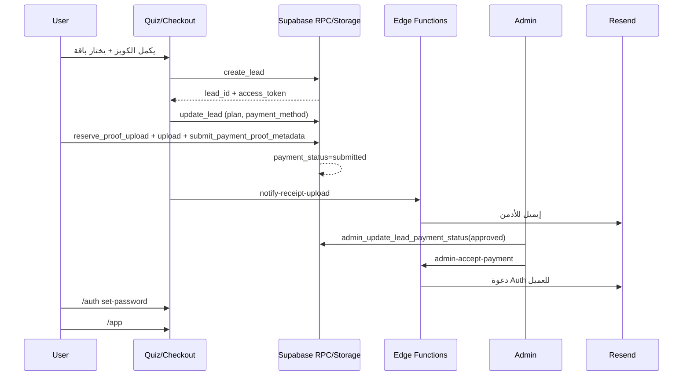

# Hakim Coaching — Master Project Documentation

**الإصدار:** 1.5
**App-First Entry:** 2026-08-14 — `/` = Quiz gateway؛ `/coaching` = Landing  
**التاريخ:** 2026-08-13  
**النطاق:** وثيقة هندسية رسمية للمشروع بالكامل  
**المستودع:** `hakimlemagicien`  
**النطاق الإنتاجي:** `https://hakimlemagicien.com`  
**مشروع Supabase:** `ufgrbpakuemamggwypdh`  
**حالة المشروع الحية:** [`PROJECT_STATUS.md`](./PROJECT_STATUS.md) — يُحدَّث عند كل milestone

---

> **تعليمات القراءة:**  
> - **أين وصلنا الآن؟** اقرأ أولاً [`PROJECT_STATUS.md`](./PROJECT_STATUS.md) — ملخص حي محدّث.  
> - **موظف جديد؟** [`PROJECT_HANDBOOK.md`](./PROJECT_HANDBOOK.md) — دستور الشركة الرسمي.  
> - **تفاصيل تقنية عميقة؟** هذه الوثيقة (Master Documentation).  
> - مبنية على قراءة الكود الفعلي، migrations، Edge Functions، Routes، Components، وscripts.  
> - عند غياب ميزة في الكود يُذكر صراحةً: **«غير موجود حالياً»**.  
> - يُفرَّق دائماً بين **الموجود** و**الرؤية المستقبلية**.

---

# 1. Executive Summary

## ما هو المشروع؟

**Hakim Coaching** منصة رقمية عربية (RTL). **App-First (2026-08-14):** `/` = App/Quiz Entry (session → `/app`)； `/coaching` = Landing التسويقية؛ `/app` = المنصة؛ `/quiz` = legacy backward-compatible. Onboarding داخل Quiz. Checkout legacy موجود لكن لا يُفتح من `reveal` في المسار الأمامي.

## الهدف

تحويل الزائر إلى عميل مدفوع عبر Funnel واضح، ثم إبقاؤه داخل منصة يومية (تمرين، تغذية، تقدم، دعم) مع تمييز بين **عضو مجاني** و**عضو Premium**.

## العميل / الجمهور

- رجال ونساء عرب (الخليج، المغرب العربي، وغيرها)
- أهداف: خسارة دهون، بناء عضلات، لياقة، شد الجسم، ثقة بالنفس
- محتوى الكويز والصور مخصص للجنسين (ذكر/أنثى)

## ما الذي يقدمه المنتج حالياً؟

| الطبقة | الحالة |
|--------|--------|
| App-First Entry (`/`) | ✅ Quiz مباشرة؛ session → `/app` |
| Marketing Landing (`/coaching`) | ✅ Landing منقولة — CTAs → `/` |
| Quiz legacy (`/quiz`) | ✅ backward-compatible — `?step=` + resume |
| Checkout (تحويل بنكي) | ⚠️ legacy — خطوات في Quiz؛ **لا تُستدعى** بعد `reveal` في المسار الأمامي |
| لوحة أدمن للمدفوعات | ✅ مكتمل |
| مصادقة + OTP/magic-link | ✅ مكتمل |
| منصة `/app` | ✅ Home, Workout, Discover, Profile, Tools |
| مكتبة تمارين (DB + UI) | ✅ جزئي — video placeholder |
| برنامج / تغذية كامل | 🚧 جزئي |
| `/onboarding` route مستقل | ❌ غير موجود |
| دفع إلكتروني (بطاقة/PayPal) | 🚧 معطّل في UI |

## رؤية المشروع

منصة لياقة عربية متكاملة: تحليل شخصي → اشتراك → برنامج يومي → تغذية → تتبع → دعم كوتش — مع محتوى مجاني (Daily Feed) ومحتوى Premium مقفل، وإمكانية توسيع لاحق لمنتجات رقمية وYouTube ومدونة.

---

# 2. Current Project Status

> **تحديث 2026-08-13:** للملخص الحي الكامل راجع [`PROJECT_STATUS.md`](./PROJECT_STATUS.md). هذا الفصل يلخّص الحقائق التقنية الأساسية.

## 2.1 ما تم إنجازه ويعمل فعلاً

### التسويق والتحويل
- **App-First Entry** (`/`) — `beforeLoad`: session → `/app`؛ بدون session → `QuizPage` + `QuizLoginEntry`
- **Marketing Landing** (`/coaching`) — Hero، Problem، … — **CTAs → `/`**
- **Quiz legacy** (`/quiz`) — نفس `QuizPage` — deep links + OTP
- **Quiz** (`/quiz`) — فانل متعدد الخطوات + **Onboarding مدمج** (verifyEmail → createPassword → profilePhoto → platformWelcome → `/app`)
- **Onboarding API:** `src/lib/quiz-onboarding-api.ts` — RPCs Phase A + OTP + avatar
- **Onboarding UI:** `src/components/quiz/QuizOnboardingScreens.tsx`
- حفظ تقدم الكويز في `localStorage` + milestones (`quiz-step-progress.ts`)
- **Checkout legacy** — خطوات `trainingType` → `pricing` → `payment` موجودة؛ **`afterReveal()` يذهب دائماً إلى `verifyEmail`** — Checkout يُفتح فقط عبر استئناف localStorage أو `?step=`
- عند **contact:** `create_lead` **+** `create_onboarding_draft` (استدعاء متوازٍ)

### الدفع والأدمن
- `/admin/payments` — مراجعة، قبول، إعادة إرسال دعوة
- Edge Functions: `admin-accept-payment`, `admin-resend-access`, `notify-receipt-upload`

### المصادقة
- `/auth` — signin/signup/set-password + OTP/magic-link callback من Quiz
- `/dashboard` → redirect `/app`

### Onboarding Database (Phase A)
- Migrations `202607111*.sql` — drafts, profiles, memberships, RPCs, RLS, avatars bucket
- **لا يوجد** route `/onboarding` — Onboarding يعمل **داخل `/quiz`**

### المنصة `/app`
- **Home hub** — DailyMotivation, tasks, hero goal images, performance (OptimizedImage, skeletons)
- **Workout** — `/app/program/workout` — player + set logs
- **Exercise library** — `/app/exercises` — DB + video placeholder strategy
- **Discover** — CMS seed + categories + search/saved
- **Profile** — account center + avatar upload
- **Tools** — calories calculator, interval timer
- **Nutrition** — hub + sub-routes (`/meal`, `/shopping`, `/progress`, `/alternatives`) — محتوى جزئي
- **Progress** — dashboard UX مبني؛ بيانات محلية/جزئية
- **Support** — FAQ + WhatsApp Premium
- Gating: tiers عبر RPC `get_my_membership` (`membership.ts`)

### البنية التحتية
- TanStack Start + Vite 8 + Nitro → Vercel
- CI: `.github/workflows/deploy.yml` + smoke tests `/`, `/quiz`
- 23 migrations + Edge Functions + Resend emails

## 2.2 Placeholder أو جزئي

| المسار | الوصف |
|--------|--------|
| `/app/nutrition` | UX hub — محتوى غذائي جزئي |
| `/app/nutrition/meal` | وجبة اليوم — جزئي |
| `/app/nutrition/shopping` | قائمة تسوق — جزئي |
| `/app/nutrition/progress` | تقدم التغذية — جزئي |
| `/app/nutrition/alternatives` | بدائل وجبات — جزئي |
| `/app/progress` | **Dashboard UX مبني** — بيانات محلية/جزئية (`progress-storage.ts`) |
| `/app/support` | FAQ + WhatsApp Premium |
| `/app/water` | **محذوف** — الماء عبر `WaterProvider` (Sheet في `PlatformShell`) |
| Checkout Paddle/Stripe | معطّل («قريباً») |
| `/onboarding` | **غير موجود** — Onboarding عبر `/quiz` |
| In-app Coach Chat | **غير موجود** — WhatsApp مؤقت |

## 2.3 لم يبدأ / غير موجود

- Landing V2 / إعادة تصميم Landing — **تراجع صريح — غير معتمد**
- مسار `/onboarding` مستقل — **غير موجود في main**
- Paddle / Stripe فعّال — **غير موجود**
- `/programs`, `/blog` — **غير موجودة**
- Push notifications — **غير موجودة**

## 2.4 قرارات UI/UX الموقوفة (2026-07/08)

| المحاولة | النتيجة |
|----------|---------|
| Landing V2 + `/onboarding` CTAs | تراجع — حفظ التصميم الأصلي |
| تحديث نصوص الهوية (Phase 1) | تراجع |
| تحويل CTAs → `/onboarding` | تراجع — المسار غير جاهز |

**القاعدة السارية:** أي تغيير Landing/Quiz/UI يحتاج اعتماد المالك خطوة بخطوة — راجع `PROJECT_STATUS.md` §2.

---

# 3. Folder Structure

```
hakimlemagicien/
├── src/
│   ├── routes/              # صفحات TanStack Router (file-based)
│   ├── components/          # UI: landing, platform, checkout, legal, motion, ui
│   ├── hooks/               # useMembership, useStreak, quiz hooks
│   ├── lib/                 # منطق الأعمال، APIs، seed، platform
│   ├── integrations/supabase/  # client, types, auth middleware
│   ├── assets/              # صور عربية (كويز، تحوّلات، أهداف)
│   ├── styles.css           # Design tokens + utilities
│   ├── router.tsx
│   ├── routeTree.gen.ts     # ⚠️ مُولَّد — لا تعدّل
│   ├── server.ts / start.ts
│   └── ...
├── supabase/
│   ├── migrations/          # SQL schema, RLS, RPCs
│   ├── functions/           # Edge Functions + _shared
│   ├── config.toml
│   └── email-templates/
├── scripts/
│   ├── exercise-library.json
│   ├── create-exercise-library.sh
│   ├── backup/
│   └── verify-vercel-build.mjs
├── docs/                    # هذه الوثيقة
├── .vercel/output/          # مخرجات البناء (Nitro)
├── vite.config.ts
├── vercel.json
├── AGENTS.md                # قواعد AI/CI + Git safety
└── package.json
```

## وظيفة المجلدات الرئيسية

| المجلد | الوظيفة | يتصل بـ |
|--------|---------|---------|
| `src/routes/` | تعريف المسارات والصفحات | `components/`, `lib/`, `hooks/` |
| `src/components/` | عرض UI حسب السياق | `lib/`, `assets/` |
| `src/lib/` | منطق غير مرئي: lead, payments, membership | `integrations/supabase/` |
| `src/integrations/supabase/` | عميل Supabase وأنواع DB | Supabase Cloud |
| `supabase/migrations/` | مصدر الحقيقة لـ Schema وRLS | `types.ts` (يُحدَّث يدوياً/أداة) |
| `supabase/functions/` | منطق خادم: إيميل، قبول دفع | Resend, service role |
| `scripts/` | أدوات محلية (مكتبة تمارين) | خارج التطبيق |

---

# 4. Architecture

## 4.1 نظرة عامة

```
[المتصفح]
    │
    ▼
[TanStack Start / React 19] ──► [Vite Build] ──► [Nitro preset: vercel]
    │
    ├── Client: Supabase JS (Auth, RPC, Storage)
    │
    └── Edge Functions (Deno)
            ├── admin-accept-payment
            ├── admin-resend-access
            └── notify-receipt-upload
                    │
                    ▼
            [Supabase PostgreSQL + Storage + Auth]
                    │
                    ▼
            [Resend API] ──► إيميلات العملاء والأدمن
```

## 4.2 Frontend

| التقنية | الإصدار/الاستخدام |
|---------|-------------------|
| TanStack Start | Full-stack React framework |
| TanStack Router | File-based routing |
| TanStack Query | Server state في `__root.tsx` |
| React | 19 |
| Vite | 8 |
| Tailwind CSS | v4 (`@theme inline`) |
| Framer Motion | حركات الكويز |
| Radix UI + shadcn | `src/components/ui/` (~48 مكوّن) |
| Lucide React | أيقونات |

**ملاحظة Lovable (تاريخية):** بعض الوثائق القديمة تشير إلى Lovable.dev. **`vite.config.ts` الحالي** يستخدم TanStack Start + Nitro مباشرة — **لا** `@lovable.dev/vite-tanstack-config`. **Needs Verification (D3):** هل Lovable ما زال في سير العمل؟

## 4.3 Backend

لا يوجد خادم Node مخصص للـ API. المنطق الخادمي عبر:
1. **Supabase RPC** (SECURITY DEFINER)
2. **Supabase Edge Functions**
3. **Supabase Auth** (جلسات JWT)

## 4.4 Supabase

- **Project ID:** `ufgrbpakuemamggwypdh` (`supabase/config.toml`)
- **Auth:** Email/password؛ روابط invite/recovery → `/auth`
- **Storage:** bucket `payment-proofs`
- **RLS:** مفعّل على كل الجداول؛ `leads` بدون SELECT مباشر للمستخدمين

## 4.5 Deployment

- **المنصة:** Vercel
- **البناء:** `npm run build` → `.vercel/output/`
- **التحقق:** `scripts/verify-vercel-build.mjs` (postbuild)
- **CI:** GitHub Actions على push إلى `main`

---

# 5. Route Map

## 5.1 جميع المسارات

| المسار | الحماية | الحالة | الوصف |
|--------|---------|--------|--------|
| `/` | عام | ✅ | **App-First Entry** — Quiz أو redirect `/app` |
| `/coaching` | عام | ✅ | **Marketing Landing** — CTAs → `/` |
| `/quiz` | عام | ✅ | Legacy — نفس Quiz + `?step=` + OTP callbacks |
| `/onboarding` | — | ❌ | **غير موجود** — Onboarding داخل `/quiz` |
| `/auth` | عام | ✅ | مصادقة + OTP callback |
| `/pricing` | عام | ✅ | Redirect إلى `/coaching#pricing` |
| `/privacy`, `/terms`, `/refund` | عام | ✅ | صفحات قانونية |
| `/dashboard` | auth | ↪️ | Redirect → `/app` |
| `/admin/payments` | admin | ✅ | مراجعة مدفوعات |
| `/app` | auth | ✅ | Home hub — DailyMotivation, tasks |
| `/app/discover` | auth | ✅ | CMS + categories + search |
| `/app/program/workout` | auth | ✅ | Workout player + set logs |
| `/app/exercises` | auth | ✅ | مكتبة تمارين (gated) |
| `/app/profile` | auth | ✅ | Account center + avatar |
| `/app/tools/calories` | auth | ✅ | حاسبة سعرات |
| `/app/tools/timer` | auth | ✅ | Interval timer |
| `/app/nutrition` | auth | 🚧 | Hub + sub-routes — محتوى جزئي |
| `/app/nutrition/meal` | auth | 🚧 | وجبة اليوم |
| `/app/nutrition/shopping` | auth | 🚧 | قائمة تسوق |
| `/app/nutrition/progress` | auth | 🚧 | تقدم التغذية |
| `/app/nutrition/alternatives` | auth | 🚧 | بدائل وجبات |
| `/app/progress` | auth | 🚧 | Dashboard UX — بيانات محلية/جزئية |
| `/app/support` | auth | 🚧/جزئي | FAQ + WhatsApp Premium |
| `/app/studio` | auth | 🔧 | Design lab (داخلي) |

**ملاحظة:** `/app/water` **غير موجود** — الماء عبر `WaterProvider` في `PlatformShell.tsx`

## 5.2 Layout Routes

- `__root.tsx` — Shell عام، PWA، FloatingWhatsApp (مخفي على `/` و`/quiz`)
- `_platform/route.tsx` — `beforeLoad`: لا session → `/auth`؛ `ssr: false`
- `_authenticated/route.tsx` — auth guard (legacy)

## 5.3 صفحات ناقصة (مخططة / غير موجودة)

- `/onboarding` — **غير موجود** (Onboarding عبر `/quiz`)
- `/programs`, `/blog` — **غير موجودة**
- لوحة أدمن أوسع (مستخدمين، محتوى، تمارين) — **غير موجودة**
- In-app chat — **غير موجود**

---

# 6. User Journey

## 6.1 Visitor (زائر)

**App-First Entry (`/`):**

| Session | السلوك |
|---------|--------|
| لا | Quiz مباشرة + «لديك حساب؟ تسجيل الدخول» → `/auth` |
| نعم | Redirect → `/app` |

**من Landing (`/coaching`):** CTA → `/`

**المسار داخل Quiz (Onboarding — `/` أو `/quiz`):**

1. يكمل أسئلة الكويز → **contact** (يستدعي `createLead` + `createOnboardingDraft`) → congrats → reveal
4. **`afterReveal()` → `verifyEmail`** (دائماً — `src/routes/quiz.tsx`)
5. Onboarding: createPassword → profilePhoto → platformWelcome
6. يدخل `/app` (tier من RPC `get_my_membership` — غالباً `free` بعد finalize)

**مسار Checkout legacy (لا يُفتح من reveal في المسار الأمامي):**

- خطوات: `trainingType` → `pricing` → `payment` → تحويل بنكي + إيصال
- **الوصول:** استئناف `localStorage`، deep-link `?step=`، أو رجوع يدوي داخل Quiz
- موافقة أدمن → إيميل دعوة → `/auth` → `/app`
- **Needs Verification (D1):** هل هذا المسار ما زال يُستخدم في الإنتاج؟

## 6.2 Free Member (مسجل بدون Premium)

**التعريف في الكود:** Auth session + RPC `get_my_membership` يُرجع tier `free` (أو `essential` / `premium` / `vip` / `admin` حسب `memberships` + `membership_tiers`).

1. `/auth` → `/app`
2. يرى Home: Daily Feed مجاني، Streak محلي
3. ميزات مدفوعة **مقفلة** حسب `features` — Upgrade → `/` أو `/quiz` (legacy)
4. `/app/support` — لا WhatsApp coach (Upgrade فقط)
5. صفحات nutrition/progress — UX مبني؛ محتوى/بيانات جزئية

## 6.3 Premium / Paid Member

**التعريف في الكود:** `get_my_membership` → tier مدفوع (`essential` / `premium` / `vip` / `admin`) مع `is_paid: true` و`features` من `membership_tiers`.

1. `/app` — بطاقات Premium **مفتوحة**
2. روابط إلى `/app/program/workout`, `/app/nutrition`, `/app/progress`, إلخ
3. `/app/support` — زر WhatsApp للكوتش (حسب tier)
4. `/app/profile` — يعرض tier من RPC

**ملاحظة:** مسار Lead القديم (`leads.payment_status`) ما زال موجوداً لـ Checkout legacy — **ليس** مصدر العضوية الأساسي في `/app`.

## 6.4 Admin

1. تسجيل دخول بحساب له `user_roles.role = admin`
2. `/admin/payments`
3. تبويب **معلّق:** عرض leads بـ `payment_status=submitted`، معاينة إيصال، قبول/رفض
4. **قبول:** RPC يفعّل lead + Edge Function يرسل دعوة Auth
5. تبويب **معتمد:** إعادة إرسال رابط الدخول

---

# 7. Authentication

## 7.1 الآلية

- **المزود:** Supabase Auth (email/password)
- **الصفحة:** `src/routes/auth.tsx`
- **أنماط:** `signin` | `signup` | `set-password`
- **روابط الدعوة:** `type=invite` أو `recovery` في hash/query → وضع `set-password`
- **PKCE:** `exchangeCodeForSession` عند وجود `?code=`
- **بعد النجاح:** `navigate({ to: "/app" })`
- **emailRedirectTo:** `${origin}/app`

## 7.2 الأدوار

| الدور | المصدر | الصلاحيات |
|-------|--------|-----------|
| `user` | `user_roles` (افتراضي عند التسجيل عبر trigger) | منصة `/app` |
| `admin` | `user_roles.role = admin` | `/admin/payments` + RPCs إدارية |

## 7.3 الجلسات

- JWT في Supabase client (`src/integrations/supabase/client.ts`)
- `_platform/route.tsx` يتحقق من `supabase.auth.getUser()` في `beforeLoad`
- Edge Functions تتطلب `Authorization: Bearer <JWT>` (ما عدا `notify-receipt-upload`)

## 7.4 إنشاء المستخدم عند القبول

`admin-accept-payment`:
- يبحث عن مستخدم Auth بالبريد
- إن لم يوجد: `auth.admin.createUser` + `generateLink` (invite)
- يربط `leads.user_id`
- يرسل الرابط عبر Resend (ليس قالب Supabase الافتراضي)

---

# 8. Membership System

## 8.1 المصدر الوحيد للمنطق (Frontend)

| الملف | الدور |
|-------|--------|
| `src/lib/platform/membership.ts` | `fetchMembershipState()` → RPC `get_my_membership` + profile snapshot |
| `src/hooks/useMembership.ts` | React Query wrapper — يستدعي `fetchMembershipState` |

**لا يوجد** `resolveMembership()` في الكود الحالي.

## 8.2 RPC `get_my_membership`

- يُستدعى عبر `supabase.rpc("get_my_membership")` في `getMyMembership()`
- يُرجع JSON يُ normalizه إلى: `tier`, `is_free`, `is_paid`, `is_active`, `features`, `subscription_id`, `starts_at`, `ends_at`, `days_remaining`
- **Tiers:** `free`, `essential`, `premium`, `vip`, `admin` (+ `visitor` محلياً عند عدم وجود session)
- **Fallback:** عند فشل RPC — `FREE_MEMBERSHIP_STATE` + profile (لا crash)
- **Localhost override:** على `127.0.0.1`/`localhost` + `/app` — يُجبر tier `free` للمعاينة

## 8.3 مصادر البيانات (DB)

| الجدول / RPC | الدور |
|--------------|--------|
| `memberships` | اشتراك المستخدم النشط |
| `membership_tiers` | تعريف tiers + `features` JSON |
| `profiles` | الاسم + `avatar_path` (SELECT مباشر من Frontend) |
| `get_my_membership` | **مصدر tier/features في `/app`** |
| `leads` / `plans` | **legacy** — مرتبط بمسار Checkout القديم؛ **ليس** مصدر العضوية في `membership.ts` |

## 8.4 Upgrade CTA

`PlaceholderState.tsx` → `UpgradeCta` → رابط `/quiz`

## 8.5 Pricing catalogs (لا تخلط)

| المصدر | الملف | الاستخدام |
|--------|-------|-----------|
| رسمي (CEO) | `src/lib/pricing-presentation.ts` | Free / Essential / Premium / VIP — 3 و6 أشهر |
| داخلي legacy | `PRICING_TIERS` في `src/routes/quiz.tsx` | شاشات pricing/payment داخل Quiz فقط |

---

# 9. Payment System

## 9.1 دورة الدفع الكاملة


```mermaid
sequenceDiagram
  participant U as User
  participant Q as Quiz/Checkout
  participant DB as Supabase RPC/Storage
  participant EF as Edge Functions
  participant A as Admin
  participant E as Resend

  U->>Q: يكمل الكويز + يختار باقة
  Q->>DB: create_lead
  DB-->>Q: lead_id + access_token
  Q->>DB: update_lead (plan, payment_method)
  U->>DB: reserve_proof_upload + upload + submit_payment_proof_metadata
  DB-->>DB: payment_status=submitted
  Q->>EF: notify-receipt-upload
  EF->>E: إيميل للأدمن
  A->>DB: admin_update_lead_payment_status(approved)
  A->>EF: admin-accept-payment
  EF->>E: دعوة Auth للعميل
  U->>Q: /auth set-password
  U->>Q: /app
```

## 9.2 Lead

- **الإنشاء:** RPC `create_lead(p_payload)` — يعيد `{ lead_id, access_token }`
- **التخزين المحلي:** `src/lib/lead-storage.ts` — `hakim_lead_id`, `hakim_lead_token`
- **التحديث:** RPC `update_lead` بتوكن الوصول
- **الحالات:** `pending_lead` → `plan_selected` → `payment_submitted` → `active`

## 9.3 الإيصال

1. `reserve_proof_upload` — يحجز مساراً في `payment-proofs` (TTL 15 دقيقة)
2. رفع الملف إلى Storage
3. `submit_payment_proof_metadata` — `payment_status = submitted`

## 9.4 موافقة الأدمن

1. `admin_update_lead_payment_status(approved)` — يضبط `status = active`
2. `invokeAdminAcceptPayment` → Edge `admin-accept-payment`
3. عند الفشل: رسالة graceful في UI (`INVITE_PENDING_MESSAGE`)

## 9.5 Plans و Payments (جداول)

- **`memberships` / `membership_tiers`:** مصدر tier في `/app` عبر `get_my_membership`
- **`plans` / `leads`:** legacy لمسار Checkout — **ليس** مصدر العضوية في `membership.ts`
- **`payments`:** Schema كامل — **لا استعلامات في `src/`** حالياً

## 9.6 طرق الدفع في UI

| الطريقة | الحالة |
|---------|--------|
| تحويل بنكي (NBD, CIH, BMCE) | ✅ فعّال |
| بطاقة / PayPal / Crypto | معطّل — «قريباً» |
| Paddle (`src/lib/paddle-checkout.ts`) | **غير موصول** بـ CheckoutScreen |

---

# 10. Database

## 10.1 الجداول

### `leads`
**الوظيفة:** سجل الفانل — إجابات الكويز، الباقة، الدفع، الإيصال، ربط المستخدم.

| حقل مهم | الوصف |
|---------|--------|
| `access_token` | وصول مجهول لتحديث Lead ورفع إيصال |
| `answers` | Json — إجابات الكويز |
| `status` | `lead_status` enum |
| `payment_status` | `payment_status` enum |
| `user_id` | يُربط بعد قبول الأدمن |
| `proof_path` | مسار Storage |

### `profiles`
**الوظيفة:** ملف المستخدم (1:1 مع `auth.users`).  
**الحقول:** `full_name`, `email`, `phone`, `goal`, `city`, `country`, ...

### `user_roles`
**الوظيفة:** `admin` | `user`

### `plans`
**الوظيفة:** خطط المشترك (`tier_id`, `is_active`, `price`, ...)

### `payments`
**الوظيفة:** سجل مدفوعات مرتبط بـ `plans` — **غير مستخدم في التطبيق حالياً**

### `quiz_answers`
**الوظيفة:** إجابات كويز للمستخدم المسجل — **غير مستخدم في التطبيق حالياً**

### `lead_proof_uploads` (migration فقط)
**الوظيفة:** حجز مسارات رفع الإيصال — **غير موجود في `types.ts`**

## 10.2 العلاقات

```text
auth.users ──1:1── profiles
auth.users ──1:N── user_roles
auth.users ──1:N── plans
auth.users ──1:N── payments ──N:1── plans
auth.users ──0:1── leads (user_id)
leads ──1:N── lead_proof_uploads
```

## 10.3 RPCs

| RPC | من يستدعيه |
|-----|------------|
| `create_lead` | Quiz (anon/auth) |
| `update_lead` | Checkout |
| `reserve_proof_upload` | lead-api |
| `submit_payment_proof_metadata` | lead-api |
| `admin_list_submitted_leads` | Admin |
| `admin_list_approved_leads` | Admin |
| `admin_update_lead_payment_status` | Admin |
| `has_role` | Policies (داخلية) |

## 10.4 جداول/ميزات ناقصة مقارنة بالرؤية

- جداول محتوى: تمارين، وجبات، برامج يومية — **غير موجودة**
- `membership` view أو RPC للمستخدم — **غير موجود**
- سجل Streak/Points — **غير موجود**

---

# 11. UI Components

## 11.1 Landing (`src/components/`)

| المكوّن | الدور |
|---------|-------|
| `Header.tsx` | تنقل + تسجيل دخول / حسابي → `/app` |
| `Hero.tsx` | القسم الرئيسي + CTA للكويز |
| `ProblemSection`, `HowItWorks`, `WhatYouGet` | شرح المشكلة والحل |
| `Results90`, `SuccessStories` | إثبات اجتماعي |
| `PricingTransparency`, `FAQ`, `FinalCTA` | تسعير وأسئلة وإغلاق |
| `FloatingWhatsApp` | واتساب عائم (مخفي على `/` و`/quiz` و`/app`) |
| `SiteFooter.tsx` | تذييل + روابط قانونية |

## 11.2 Checkout (`src/components/checkout/`)

| المكوّن | الدور |
|---------|-------|
| `CheckoutScreen.tsx` | شاشة الدفع الرئيسية |
| `BankTransferModal.tsx` | بيانات الحساب البنكي |
| `ReceiptUploadSection.tsx` | رفع الإيصال |
| `PaymentMethodOption.tsx` | بطاقات طرق الدفع |
| `CheckoutSummaryCard.tsx` | ملخص الباقة |

## 11.2.1 استراتيجية التسعير وتفعيل البرامج (Pricing & Activation)

> السياسة الرسمية: [`PROJECT_HANDBOOK.md` §4.5](./PROJECT_HANDBOOK.md).  
> الكود المشترك: `src/lib/pricing-presentation.ts` (`FREE_TIER`, `PAID_TIERS`, `ACTIVATE_PROGRAM_CTA`).

### الكتالوج والمدد

| الباقة | الدور في المنتج |
|--------|-----------------|
| Free | دخول الجميع |
| Essential | المنتج الرئيسي |
| Premium | Essential + إضافات |
| VIP | أعلى متابعة |

مدد مدفوعة فقط: **3 أشهر** | **6 أشهر** (لا شهري أساسي). شارة **أفضل قيمة** لـ 6 أشهر + توفير.

### عرض السعر

| القاعدة | التطبيق في الكود |
|---------|------------------|
| السعر الإجمالي = الرسمي | بارز في بطاقة المدة و`CheckoutSummaryCard` |
| المدة واضحة | `3 أشهر` / `6 أشهر` |
| التكلفة اليومية = توضيحية | `formatIllustrativeDaily` — لا كسعر دفع |
| التوفير | `formatSavings` عند مدة 6 أشهر |
| CTA تفعيل | `ACTIVATE_PROGRAM_CTA` = «فعّل برنامجك الآن» |
| CTA بعد الملخص | `CONTINUE_PAYMENT_CTA` = «متابعة الدفع» |

### رحلة التفعيل (مستهدفة في المنتج)

```
Free → فعّل برنامجك الآن → باقة → مدة → ملخص → دفع → تفعيل → برنامج شخصي
```

| وسيلة الدفع | تفعيل المزايا |
|-------------|----------------|
| تحويل بنكي | بعد اعتماد الأدمن فقط — حالة «قيد التفعيل» أثناء المراجعة |
| فوري (بطاقة / Apple Pay / PSP) | مباشرة بعد نجاح الدفع |

**الحالة الحالية في الكود:** التحويل البنكي + مراجعة أدمن شغّال؛ وسائل الدفع الفورية ما زالت قيد التفعيل في الواجهة وفق سياسة المشروع.

ممنوع: إخفاء الإجمالي، أو جعل الرقم اليومي يبدو كالمبلغ المستحق، أو منح مزايا مدفوعة قبل اعتماد التحويل البنكي.


## 11.3 Platform (`src/components/platform/`)

| المكوّن | الدور |
|---------|-------|
| `PlatformShell.tsx` | Layout؛ no-scroll على `/app` mobile |
| `PlatformNav.tsx` | Sidebar desktop + bottom nav 5 عناصر |
| `HomeSections.tsx` | Header, Stats, Daily Feed, Upgrade banner |
| `PremiumPreviewGrid.tsx` | Program carousel, Features 2×2 |
| `PlaceholderState.tsx` | حالة فارغة + `UpgradeCta` |

## 11.4 UI Kit (`src/components/ui/`)

مكوّنات shadcn/Radix قياسية: `button`, `card`, `dialog`, `form`, `input`, `chart`, ...

---

# 12. Design System

## 12.1 المصدر

`src/styles.css` — Tailwind v4 مع `@theme inline`

## 12.2 الألوان (`:root`)

| Token | القيمة التقريبية | الاستخدام |
|-------|------------------|-----------|
| `--primary` | Orange `#F97316` | CTA، أزرار، Landing |
| `--success` | Green `#22C55E` | نجاح، شارات |
| `--beige` | `#FAF6F2` | خلفيات دافئة |
| `--background` / `--foreground` | أبيض / داكن | أساس |
| Platform mobile | `#8B5CF6` (بنفسجي) | **مستخدم inline** في PlatformNav/Home — ليس token عام |

## 12.3 Typography

- `--font-sans`, `--font-display`: **Tajawal**, **Cairo**
- RTL: `dir="rtl" lang="ar"` على الصفحات العربية

## 12.4 Spacing & Radius

- `--radius: 1rem` + مشتقات sm→3xl
- Platform mobile: `gap-2.5`, `rounded-2xl` للبطاقات

## 12.5 Cards & Buttons

- Landing: `shadow-cta`, `cta-gradient` utility
- Platform: `shadow-[0_4px_20px_...]`, بطاقات pastel
- Buttons: `UpgradeCta` — `bg-primary` أو بنفسجي في المنصة

## 12.6 Icons

- **Lucide React** في كل المشروع
- `WhatsAppIcon.tsx` مخصص

---

# 13. Exercise Library

## 13.1 الوضع الحالي

المكتبة **خارج التطبيق** — لا يستوردها أي ملف في `src/`.

## 13.2 الملفات

| الملف | الوصف |
|-------|--------|
| `scripts/exercise-library.json` | **320 تمرين** — 13 مجموعة |
| `scripts/create-exercise-library.sh` | مولّد المجلدات |
| `scripts/backup/*-2026-07-06.*` | نسخة احتياطية |

## 13.3 بنية JSON

```json
{
  "Chest": [
    {
      "id": "CH-001",
      "name": "Bench Press",
      "name_ar": "بنش برس",
      "equipment": "",
      "level": "",
      "status": "placeholder"
    }
  ]
}
```

**المجموعات (13):** Chest (14), Back (31), Warm Up (25), Mobility (25), Shoulders (30), Biceps (20), Triceps (20), Forearms (15), Legs (45), Glutes (25), Calves (15), Abs (30), Cardio (25)

## 13.4 هيكل المخرجات (على الجهاز المحلي)

```text
~/Documents/Hakim Coaching Platform/
├── Assets/placeholder-exercise.mp4
└── Exercise Library/
    └── <MuscleGroup>/
        └── <ID>-<slug>/
            ├── exercise.mp4
            ├── instructions.mp4
            └── metadata.json
```

## 13.5 metadata.json (قالب السكربت)

```json
{
  "id": "", "slug": "", "name": "", "name_ar": "",
  "primary_muscle": "", "secondary_muscles": [],
  "equipment": "", "difficulty": "", "exercise_type": "",
  "video_status": "placeholder", "instructions_status": "placeholder",
  "duration_seconds": 30, "youtube_url": "", "coach_notes": "",
  "created_at": "", "updated_at": ""
}
```

## 13.6 قواعد السكربت

- لا يحذف ملفات موجودة
- لا يستبدل `exercise.mp4` / `instructions.mp4` الموجودين
- لا يعدّل `metadata.json` الموجود
- لا ينشئ `thumbnail.jpg`
- Parser: Python مدمج (بدون jq)

## 13.7 تحديث الفيديوهات (العملية اليدوية الحالية)

1. استبدال `exercise.mp4` و`instructions.mp4` يدوياً في مجلد التمرين
2. تحديث `metadata.json`: `video_status`, `instructions_status`, `youtube_url`, `updated_at`
3. **لا يوجد** pipeline آلي في المشروع لرفع الفيديوهات إلى التطبيق

---

# 14. Nutrition Library

## الوضع الحالي: **UX جزئي**

- `/app/nutrition` — hub (`src/routes/_platform/app/nutrition/index.tsx`)
- Sub-routes: `/meal`, `/shopping`, `/progress`, `/alternatives`
- لا يوجد `nutrition-library.json` مركزي — محتوى seed/جزئي
- `seed-content.ts` يحتوي بطاقة «وصفة اليوم» نصية في Daily Feed — **ليست مكتبة**
- الرؤية المستقبلية: مكتبة وجبات + macros + ربط ببرنامج المستخدم (Phase 2)

---

# 15. Programs

## الوضع الحالي

- `/app/program/workout` — **Workout player + set logs** (يعمل)
- لا route `/app/program` index منفصل في `routeTree.gen.ts`
- `PROGRAM_CAROUSEL_SEED` في `seed-content.ts` — 4 شرائح نصية للعرض في Home
- لا يوجد جدول `programs` أو `workout_days` في DB
- لا ربط بين `leads.answers` وبرنامج يومي معروض

## الرؤية المستقبلية

- برنامج 90 يوم مخصص حسب إجابات الكويز
- أيام/تمارين/sets/reps من مكتبة التمارين
- تتبع إنجاز اليوم في `/app/program/workout`
- مزامنة Premium gating مع `membership`

---

# 16. Content Strategy

## 16.1 المحتوى المجاني (الحالي)

| المصدر | النوع | الحالة |
|--------|-------|--------|
| Landing | تسويق | ✅ |
| Daily Feed | seed ثابت | ✅ UI فقط |
| `/app/discover` | مكتبة مجانية | ✅ CMS seed + categories |

## 16.2 Premium

- برنامج، تغذية، تقدم، دعم كوتش — مقفل لـ Free عبر `isPremium`
- المحتوى الفعلي **غير مبني** — القفل يعمل على مستوى UI والروابط

## 16.3 Digital Products

- الباقات تُختار في الكويز (`tier_id`, `tier_name`, `plan_price` في `leads`)
- لا متجر منفصل أو منتجات رقمية متعددة — **مسار واحد عبر الكويز**

## 16.4 YouTube

- حقل `youtube_url` في metadata التمارين — **للاستخدام المستقبلي**
- لا تكامل YouTube في التطبيق — **غير موجود**

---

# 17. Admin Panel

## المسار الوحيد: `/admin/payments`

### الصلاحيات

| الإجراء | الآلية |
|---------|--------|
| الدخول | `user_roles.role = admin` |
| عرض leads معلّقة | RPC `admin_list_submitted_leads` |
| عرض leads معتمدة | RPC `admin_list_approved_leads` |
| معاينة إيصال | Signed URL من bucket `payment-proofs` |
| قبول | `admin_update_lead_payment_status(approved)` + `admin-accept-payment` |
| رفض | `admin_update_lead_payment_status(rejected)` |
| إعادة إرسال دخول | `admin-resend-access` |

### ما لا يستطيع الأدمن فعله (غير موجود)

- إدارة محتوى / تمارين / وجبات
- إدارة مستخدمين عامة
- تعديل برامج العملاء
- إحصائيات Dashboard

---

# 18. Security

## 18.1 RLS

- **`leads`:** REVOKE ALL من anon/authenticated — الوصول عبر RPC فقط + service_role
- **`profiles`, `plans`, `payments`, `quiz_answers`:** المستخدم يرى/يعدّل ذاته فقط؛ الأدمن SELECT
- **`user_roles`:** SELECT ذاتي؛ تعديل للأدمن فقط

## 18.2 Storage

- `payment-proofs`: رفع بمسار محجوز؛ قراءة الأدمن عبر policy مخصصة
- إثباتات الدفع **ليست** عامة

## 18.3 Auth

- JWT للجلسات
- Edge `admin-*`: `verify_jwt = true`
- `notify-receipt-upload`: `verify_jwt = false` — يعتمد على `leadId` + `accessToken`

## 18.4 Secrets

| Secret | الاستخدام |
|--------|-----------|
| `VITE_SUPABASE_*` | Client |
| `SUPABASE_SERVICE_ROLE_KEY` | Edge Functions |
| `RESEND_API_KEY` | إيميلات |
| `SITE_URL` | روابط Auth (إجبار production) |
| `ADMIN_NOTIFICATION_EMAIL` | إشعار الأدمن |
| `EMAIL_FROM` | مرسل Resend |
| `VERCEL_TOKEN` | CI deploy |

**تحذير:** ملف `.env` موجود في المستودع — يجب عدم commit قيم حقيقية (تحقق من `.gitignore`).

## 18.5 SECURITY DEFINER

RPCs الحساسة (`create_lead`, `admin_*`, `update_lead`, ...) تعمل بصلاحيات مرتفعة مع فحوصات داخل الدالة.

---

# 19. Current Problems

## 19.1 مشاكل تقنية

| # | المشكلة | التأثير |
|---|---------|---------|
| 1 | RPC `get_my_membership` — **Needs Verification (D5)** على تطبيق migrations في الإنتاج | فشل RPC → fallback `free` في Frontend |
| 2 | `lead_proof_uploads` غير موجود في `types.ts` | Type-safety ناقص |
| 3 | `payments` / `quiz_answers` غير مستخدمين | Schema ميت جزئياً |
| 4 | `plans` لا يُحدَّث تلقائياً عند قبول الدفع | اعتماد على `leads` للعضوية |
| 5 | Streak/Points في localStorage فقط | لا مزامنة بين أجهزة |
| 6 | Paddle موجود لكن غير موصول | التباس للمطورين |
| 7 | — | (تمت إضافة `README.md`) |
| 8 | مكتبة التمارين خارج التطبيق | لا قيمة للمستخدم النهائي بعد |
| 9 | Platform بنفسجي vs Landing برتقالي | هوية بصرية مزدوجة |
| 10 | `notify-receipt-upload` بدون JWT | يعتمد على معرفة leadId+token — مقبول لكن يحتاج rate limiting |

## 19.2 مخاطر تشغيلية

- Migrations يجب تطبيقها يدوياً على Supabase (خصوصاً `20260705090000`)
- Edge Functions يجب نشرها يدوياً
- Auth URL config في Supabase Dashboard (Site URL, Redirect URLs)
- تجنب force-push على `main` (راجع `AGENTS.md`)

## 19.3 أجزاء ناقصة حرجة للمنتج

- محتوى برنامج حقيقي
- مكتبة تغذية
- Membership RPC موثوق
- دفع إلكتروني

---

# 20. Recommended Improvements

## Critical

1. **تطبيق migrations + التحقق من RPC `get_my_membership` في الإنتاج** — Needs Verification (D5)
2. **تطبيق migrations + نشر Edge Functions** على الإنتاج
3. **ربط `plans` عند قبول الأدمن** — sync مع lead
4. **إزالة/تأمين `.env`** من التتبع إن كان مكشوفاً

## High

5. **Phase 2 Program** — أول نسخة برنامج من `exercise-library.json`
6. **مزامنة Streak** — جدول بسيط أو Supabase
7. **توحيد Design tokens** للمنصة (بنفسجي → token رسمي)
8. **اختبارات E2E** لمسار الدفع

## Medium

9. Nutrition library + صفحة `/app/nutrition`
10. Progress tracking (وزن، صور)
11. ربط `payments` table بسجل الدفع في Profile
12. توليد `types.ts` من migrations تلقائياً

## Low

13. `/programs`, `/blog` عامة
14. In-app chat
15. Paddle/Stripe
16. Push notifications

---

# 21. Future Roadmap

## المرحلة الحالية (تم)

- Landing + Quiz + Bank Checkout + Admin + Auth + Platform Shell (Phase 1)

## Phase 2 — العضوية والمحتوى الأساسي

- Program days من مكتبة التمارين
- Nutrition أساسي
- Progress (وزن + صور)
- Membership RPC + gating كامل
- FAQ Support حقيقي

## Phase 3 — DB المحتوى

- جداول exercises, meals, program_templates
- Admin لإدارة المحتوى (أو sync من JSON/ملفات)

## Phase 4 — Discover + مجتمع

- محتوى مجاني يومي من DB
- مدونة / فيديوهات

## Phase 5 — مدفوعات متقدمة + توسع

- Stripe/Paddle
- منتجات رقمية متعددة
- تطبيق موبايل (PWA محسّن أو native)

---

# 22. Files That Should Never Be Modified

| الملف | السبب |
|-------|--------|
| `src/routeTree.gen.ts` | مُولَّد بواسطة TanStack Router — يُستبدل عند build |
| `src/integrations/supabase/client.ts` | مُولَّد — Supabase CLI |
| `.vercel/output/**` | مخرجات build — تُعاد توليدها |
| `AGENTS.md` | قواعد AI/CI — لا force-push على `main` |
| Git history على `main` | لا force-push |

**يُعدَّل بحذر:**
- `src/routes/quiz.tsx` — ملف ضخم؛ أي تغيير يحتاج اختبار الفانل كاملاً
- `supabase/migrations/` — لا تعدّل migrations منشورة؛ أضف migration جديدة
- `src/integrations/supabase/types.ts` — حدّث بعد تغيير Schema

---

# 23. Development Rules

## 23.1 من AGENTS.md

- **لا force-push** على `main` (راجع `AGENTS.md`)
- **لا** force-push أو rebase/amend/squash لcommits مدفوعة
- أبقِ الفرع في حالة عمل

## 23.2 من ممارسات المشروع

| القاعدة | التفاصيل |
|---------|----------|
| مسار المنصة | `/app` (ليس `/dashboard`) |
| لا تلمس | Landing, Quiz, Admin إلا بطلب صريح (قرار Phase 1) |
| Upgrade CTA | دائماً → `/quiz` |
| Coach Chat مؤقتاً | WhatsApp URL في `seed-content.ts` |
| Commit | فقط عند طلب المستخدم |
| التوجيه | TanStack file-based — لا `src/pages/` |

## 23.3 تسمية الملفات

- Routes: `src/routes/**/*.tsx` — `createFileRoute`
- Layouts: `_platform/route.tsx`, `_authenticated/route.tsx`
- Components: PascalCase — `HomeSections.tsx`
- Lib: kebab-case — `lead-api.ts`, `admin-payments-api.ts`
- Platform: `src/components/platform/`, `src/lib/platform/`

## 23.4 الكود

- TypeScript strict
- Tailwind + `cn()` من `lib/utils.ts`
- RTL: `dir="rtl" lang="ar"` على الصفحات العربية
- `ssr: false` على routes التي تستخدم `window` / Supabase client مباشرة

---

# 24. Project Identity

## ما يميز المشروع

- **عربي أصيل RTL** — ليس ترجمة
- **فانل كويز عميق** — تخصيص ذكر/أنثى بصري
- **دفع بنكي يدوي** — مناسب للسوق العربي (الإمارات، المغرب)
- **كوتش حقيقي** — Hakim، صور تحوّل، WhatsApp
- **منصة يومية** — ليس مجرد PDF برنامج

## الفلسفة

«تحليل شخصي مجاني → برنامج مخصص مدفوع → متابعة يومية داخل المنصة»

## ما نبني

منصة لياقة **رقمية عربية** تجمع التسويق، الدفع، العضوية، والمحتوى التدريبي في منتج واحد — بدءاً من الكويت/الخليج والمغرب العربي.

---

# 25. Final Evaluation

## نقاط القوة

1. **فانل تحويل + Onboarding** — Landing → Quiz → email/password/avatar → `/app`
2. **أمان leads + onboarding** عبر RPC + RLS
3. **تجربة كويز غنية** — محتوى مرئي عربي + injuries + progress UX
4. **بنية حديثة** — TanStack Start, React 19, Supabase
5. **مكتبة تمارين DB** — 320 تمرين + workout player + video strategy
6. **منصة متقدمة** — Discover, Profile, Tools, Home hub, performance

## نقاط الضعف

1. **فجوة المحتوى** — nutrition/progress جزئيان
2. **عضوية غير موثوقة 100%** بسبب RLS على leads
3. **ازدواجية هوية بصرية** Landing vs Platform
4. **لا مسار `/onboarding` مستقل** — Onboarding داخل Quiz
5. **Landing V2 / نصوص الهوية** — موقوف بقرار المالك
6. **اعتماد على عمليات يدوية** (deploy, فيديوهات)

## الفرص

- Onboarding DB جاهز — فصل `/onboarding` لاحقاً
- Workout player + exercise library يعملان
- Discover CMS + Profile + Tools للتوسع
- سوق عربي كبير للتدريب الرقمي

## المخاطر

- تأخر برنامج/تغذية كامل يقلل قيمة Premium
- تعديل Landing/Quiz دون اعتماد يخالف DS1
- فشل sync Git إن لم تُحترم AGENTS.md
- إيميلات Auth خاطئة إن لم يُضبط `SITE_URL`

## تقييم CTO (ملخص — 2026-08-13)

المشروع في مرحلة **«MVP تشغيلي + منصة يومية جزئية»**. الأولوية: **membership موثوق + محتوى برنامج/تغذية كامل**. Landing **محمية** — لا تغيير UI دون اعتماد. التقييم الفني: **7.5/10**. تقييم المنتج: **6/10**.

---

## ملحق أ — أوامر التطوير

```bash
npm run dev      # تطوير محلي
npm run build    # بناء + verify-vercel-build
npm run lint     # ESLint
```

## ملحق ب — Edge Functions deploy (يدوي)

```bash
supabase functions deploy admin-accept-payment
supabase functions deploy admin-resend-access
supabase functions deploy notify-receipt-upload
```

## ملحق ج — مراجع الملفات الأساسية

| الموضوع | الملف |
|---------|-------|
| Membership | `src/lib/platform/membership.ts` |
| Lead API | `src/lib/lead-api.ts` |
| Onboarding API | `src/lib/quiz-onboarding-api.ts` |
| Onboarding UI | `src/components/quiz/QuizOnboardingScreens.tsx` |
| Admin API | `src/lib/admin-payments-api.ts` |
| Platform Home | `src/routes/_platform/app/index.tsx` |
| Project Status | `docs/PROJECT_STATUS.md` |
| Quiz | `src/routes/quiz.tsx` |
| Types | `src/integrations/supabase/types.ts` |
| Exercise JSON | `scripts/exercise-library.json` |
| Design | `src/styles.css` |

---

*نهاية الوثيقة — Hakim Coaching Master Project Documentation v1.0*